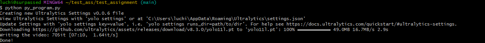

Описание проекта
---
Проект направлен на реализацию системы распознавания людей на видео. Все компоненты системы (считывание кадров, загрузка модели с предобученными весами и инференс, отрисовка предсказаний, запись видео) реализованы в виде классов.

Основные файлы notebook_program.ipynb и py_program.py содержат один и тот же код. Файл py_program.py создан для быстрого запуска программы одним скриптом.

Реализация компонентов программы выполнена с использованием классов: VideoReader; VideoSaver; ImageRecDrawing; ModelLoad.

Интеграция компонентов для создания видео происходит в функции make_video().

Код соответствует стандартам PEP8.

Запуск программы
---
1. Убедитесь, что видео **crowd.mp4** находится в том же месте, что и **py_program.py** файл
2. Перейдите в командную строку и установите необходимые библиотеки, названия которых находятся в файле **requirements.txt**
```bash
pip install -r requirements.txt
```
3. Запустите скрипт **py_program.py** используя Python
```bash
python py_program.py
```
В коммандной строке должен появится процесс создания видео (примерно занимает 4 минуты)

4. В рабочей директории должно появится видео **videoWithBoundingBoxes.mp4** 
